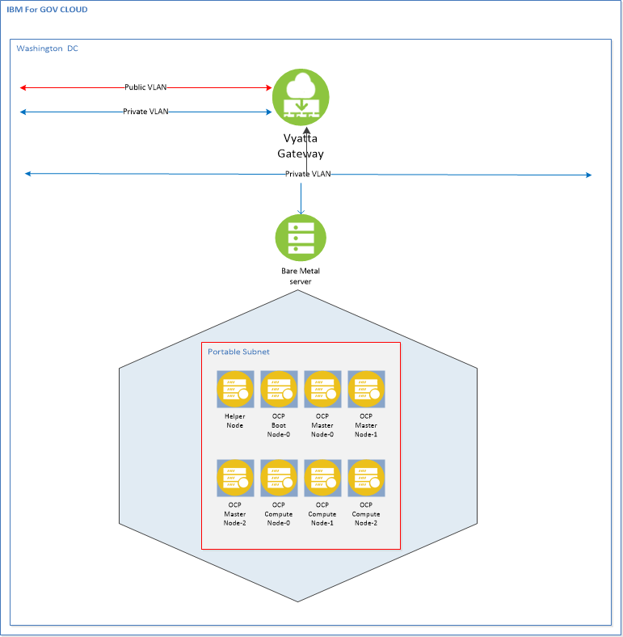

Installing OCP 4.3 with KVM
===========================

This Guide will get you up and running using KVM `libvirt`. This setup should
work for both RedHat or Centos OS 7.X. You will need to deploy a bare-metal IBM
Cloud to act as the KVM Host. For this deployment we setup a CentOS Bare Metal server
with 48 CPU, 256 GB RAM, and 1 TB storage. Your mileage may vary based on your
specific needs.

All the OpenShift Guest VMs will be deployed using ansible scripts.

> **NOTE:**
>
> Before you begin, understanding your IP addresses is very important. The IP
> addresses used in this process and the configuration files came from our IC4G
> environment. They are used here for illustration purpose only. When you order
> your KVM Host server, you will also need to order a minium of 16 portable IP
> addresses. Each VM node takes up one IP address. The recommended minimum of 16 portable IP
> addresses is determined by: 1 helper node + 1 boot node + 3 control-plane
> nodes + 3 worker nodes = 8 nodes IC4G reserves 4 IP addresses out of every
> portable IP subnet. Therefore 8 + 4 = 12. The extra four IP addresses are
> available for additional worker nodes. You should plan your ip address space
> accordingly.

Architecture Diagram
--------------------



Network requirements
--------------------

In this environment, we used the Vyatta Firewall available in the IBM Cloud for
Government. This allows us the flexibility to setup various Private and Public
VLANs as needed for a more complex environment. The Vyatta is not required and
its  setup is not addressed here. For a simpler installation, establish a public
port on the Load Balancer node and manage the firewall settings on that node.

Hardware requirements
---------------------

| Node Name       | vCPU   | Mem  | HDD | Role
| ------          | ------ |----  | --- | ------ |
| Helper Node | 4  | 16 | 150 | DNS/Proxy/DHCP/OCP Installer|
| Bootstrap | 4  | 16 | 150 | Bootstrap OCP |
| Master0  |  4 | 16 | 150 | Master OCP |
| Master1  |  4 | 16 | 150 | Master OCP |
| Master2  |  4 | 16 | 150 | Master OCP |
| Worker0 | 4 | 16 | 150 | Compute OCP |
| Worker1 | 4 | 16 | 150 | Compute OCP |
| Worker2 | 4 | 16 | 150 | Compute OCP |


Setup KVM Host
--------------

To run ansible scripts, the ansible rpm and python library need to be installed. Use the
following commands:
```
sudo yum update
sudo yum install ansible
sudo yum install git
sudo yum install python-pip gcc make openssl-devel python-devel
sudo pip install --upgrade ansible
```
> **NOTE:** For RedHat if you get error message that said "No package ansible available" when you execute the command "sudo yum install ansible",  execute "sudo rpm -Uvh https://dl.fedoraproject.org/pub/epel/epel-release-latest-7.noarch.rpm" and then execute "sudo yum install ansible".

> **NOTE:**  If you get error message that said "No package python-pip available." when you execute the command "sudo yum install python-pip",  execute "curl "https://bootstrap.pypa.io/get-pip.py" -o "get-pip.py" "python get-pip.py" and then execute "sudo yum install ansible".


KVM will be used to create and manage virtual machines. The KVM command
line tool is virt-install and the GUI tool is virt-manager. To use the
KVM GUI tool, install Gnome desktop and VNC.
```
yum groupinstall "GNOME Desktop" "Graphical Administration Tools" --setopt=group_package_types=mandatory,default,optional

```    
> **NOTE:** For RedHat, to install GNOME desktop do: yum groupinstall "Server with GUI"
```    
yum install tigervnc*
ln -sf /lib/systemd/system/runlevel5.target /etc/systemd/system/default.target
reboot
```
Log back in to the KVM host to setup VNC using the following commands:
```
vncserver
vncpasswd
```
Prepare the Host KVM
--------------------

Login to the Host KVM as root and execute the following commands.
```
cd /opt
git clone https://github.com/fctoibm/ocpkvm4.3.git
cd /opt/ocpkvm4.3
```
Edit the [vars.yaml](./vars.yaml) file with the IP addresses that will be
assigned to the masters/workers/boostrap. The IP addresses need to be
right since they will be used to create your OpenShift servers.

Edit the [hosts](./hosts) file kvmguest section to match the helper node
information. This should be similar to vars.yaml file

Run the ansible playbooks
-------------------------

Run the playbook to setup the helper node
```
ansible-playbook -e @vars.yaml  play.yaml
```
### If the ansible playbook fails

If the ansible scripts fail, execute the following script to clean the
environment:
```
ansible-playbook -e @vars.yaml  clean.yaml
```
After it is done, ssh into the helper node, and run the following
command to get info about the environment and some installation help:

    /usr/local/bin/helpernodecheck

Install RHCOS on the VMs
------------------------

From this point forward, all work is done on the helper node.

At this point the bootstrap VM, the master VMs and the workers VMs are
created, but OS has yet to be installed on the VMs. All the VMs except
for the helper node are in shutdown status.

This section provides instructions for installing the OS to each VM.

To ensure that the IP address is assigned to each VM as defined in the
vars.yaml file, it is important that the VM is started and the OS
installed in the following order:

1.  Bootstrap
2.  Master 0
3.  Master 1
4.  Master 2
5.  Worker 0
6.  Worker 1
7.  Worker 2

Logon to the helper node. Launch `virt-manager`

[](https://youtu.be/2SkIdhBi0OI)

Each of the VM needs to be PXE bootable (Pre-Boot Execution Environment).
The result is an IP address assigned to the VM and the OS installed.

Follow these steps to get to the PXE menu:

Since the bootstrap VM is the first VM to be started, right click on
ocp4-boostrap. Select Open. The ocp4-bootstrap console is displayed


Select the play button. The message "Press ESC for boot menu" will be
displayed. Promptly press the ESC key. The message "Select boot device:"
will be displayed. Select option "iPXE"


The PXE Boot Menu will be displayed:


- If the VM is the bootstrap VM, select option 1) Install Bootstrap Mode.
- If the VM is the master-x VM, select option 2) Install Master Node and
- If the VM is the worker-x VM, select option 3) Install Worker Node.

Wait for the PXE boot to complete before moving on to start the next VM.
When the PXE boot is completed, an IP address is assigned to the VM and
the login prompt will be displayed like the following screen capture.
Ignore the error messages.


Wait for the install to be completed on all VMs
-----------------------------------------------

The bootstrap VM does the OS installation for all the VMs. Wait for the
PXE boot to be completed on each VM. When the PXE boot is done on the
worker-2 node, ssh to the helper node. Execute the following command to
check that the bootstrap node is finished with installation.

ssh into helper node and execute the following command
```
cd /opt/ocp4
openshift-install wait-for bootstrap-complete --log-level debug
```
The following messages will be displayed when the bootstrap completes
installation:

`DEBUG OpenShift Installer v4.2.0 `\
`DEBUG Built from commit 90ccb37ac1f85ae811c50a29f9bb7e779c5045fb `\
`INFO Waiting up to 30m``0s for the Kubernetes API at https://api.ocp4.example.com:6443... `\
`INFO API v1.14.6+2e5ed54  up                       `\
`INFO Waiting up to 30m0s for bootstrapping to complete... `\
`DEBUG Bootstrap status: complete                   `\
`INFO It is now safe to remo``ve the bootstrap resources`

When the above messages are displayed, then it is safe to shutdown and
delete the bootstrap VM, and proceed to the next section.

Finish Installing OCP
---------------------

ssh to the helper node from the KVM host and execute the following commands.

```
cd /opt/ocp4
export KUBECONFIG=/opt/ocp4/auth/kubeconfig
```

You must configure storage for the image registry Operator. For non-production clusters, you can set the image registry to an empty directory. Execute the following command to set the registry to an empty directory. (To use Persistent Volumes (PVs), perform the setup described
[here](https://docs.openshift.com/container-platform/4.1/installing/installing_bare_metal/installing-bare-metal.html#registry-configuring-storage-baremetal_installing-bare-metal))

```
oc patch configs.imageregistry.operator.openshift.io cluster --type merge --patch '{"spec":{"storage":{"emptyDir":{}}}}'
```

If you require external access to the image registry or need to log in to the registry from outside the cluster, run the following command to expose the registry:

```
oc patch configs.imageregistry.operator.openshift.io/cluster --type merge -p '{"spec":{"defaultRoute":true}}'
```

Execute the next command to finish the install process:

```
openshift-install wait-for install-complete
```

When the installation is completed, messages similar to the following
will be displayed:
```
INFO Waiting up to 30m0s for the cluster at https://api.test.os.fisc.lab:6443 to initialize...
INFO Waiting up to 10m0s for the openshift-console route to be created...
INFO Install complete!                            
INFO To access the cluster as the system:admin user when using 'oc', run 'export KUBECONFIG=/opt/ocp4/auth/kubeconfig'
INFO Access the OpenShift web-console here: https://console-openshift-console.apps.test.os.fisc.lab
INFO Login to the console with user: kubeadmin, password: ###-????-@@@@-****
```
> Make note of the OpenShift web-console URL, login user id and password.

Update IP tables on KVM Host to access OpenShift URL
----------------------------------------------------

On KVM Host run the following commands:
```
iptables-saves < /root/savedrules.txt
iptables -I FORWARD -o openshift4 -d  <HELPER_NODE_IP> -j ACCEPT
iptables -t nat -I PREROUTING -p tcp --dport 443 -j DNAT --to <HELPER_NODE_IP>:443
```
> Where, <HELPER_NODE_IP> is the IP address of the helper node

Add following line to your /etc/hosts files on the server from where will allow access to your OpenShift URL:
```
<HOST_KVM_IP> console-openshift-console.apps.<base_domain_prefix>.<base_domain>  oauth-openshift.apps.<base_domain_prefix>.<base_domain>
```
> Where, <HOST_KVM_IP> is the IP address of the KVM Host bare metal server
